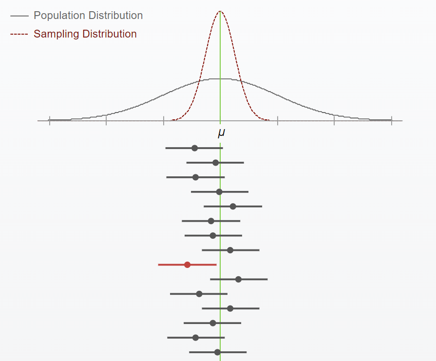

# Öryggisbil

Niðurstöður eru marktækar svo nú göngum við út frá því að það sé launamunur eftir menntun. Næsta spurning er þá "*Hve miklu munar á launum þeirra sem hafa háskólamenntun og þeirra sem hafa hana ekki?*". Möguleikarnir eru ótalmargir, svo gefum okkur tvær aðstæður:

1.  Munurinn er að jafnaði 10.000kr á mánuði. Þrátt fyrir að sá munur væri *marktækur* þá er hann vissulega ekki *merkilegur* -- enda svarar það varla kostnaði að lifa við skertar tekjur til fleiri ára til að sækja sér menntun, ef afrakstur þess eru 10.000kr aukalega á mánuði í kjölfarið.
2.  Munurinn er að jafnaði 150.000kr á mánuði. Þetta eru vissulega merkilegri (og skemmtilegri) niðurstöður heldur en í dæminu á undan.

Bæði dæmin lýsa **punktspá**; það næsta sem við komumst að vita hver munurinn sé í þýði er með því að athuga hver munurinn er í úrtakinu.

Við vitum þó að ekki **öll** sem hafa háskólamenntun fái ákkurat 150.000kr hærri laun á mánuði -- enda vissulega fleiri þættir sem spila inn í. Pælingin verður þá "hversu mikið gæti þetta spágildi rokkað til eða frá?". Þessari pælingu er svarað með **bilspá**; öryggisbil er sennilega dæmi um þá bilspá sem er mest notuð. Öryggisbil gefa okkur **vikmörk** í kringum punktspána. Þegar hingað er komið vitum við að "það er munur og hann er að jafnaði 150.000kr á mánuði". Öryggisbil bætir við þessa túlkun -- tökum tvö dæmi:

1.  Öryggisbil = [140.000 ; 160.000]
    -   Það er, launamunur er að jafnaði 150.000kr -- til eða frá 10.000kr.

    -   Hér er öryggisbilið þröngt, punktspáin helst óbreytt og það er lítil óvissa sem fylgir henni.
2.  Öryggisbil = [10.000 ; 290.000]
    -   Það er, launamunur er að jafnaði 150.000kr á mánuði - til eða frá 140.000kr.

    -   Hér er öryggisbilið vítt, punktspáin helst óbreytt en það er mikil óvissa sem fylgir henni. Þessi óvissa endurspeglast í því að munurinn gæti verið allt frá mjög ómerkilegum upp í umtalsverðan; hann gæti verið 10.000kr fyrir suma, upp í 290.000kr fyrir aðra.

Í seinna dæminu er óvissan töluvert meiri og niðurstöðurnar eru í raun að gefa okkur minni upplýsingar heldur en í fyrra dæminu. Seinna dæmið væri í raun að segja "það er sennilega fínn munur, hann gæti líka verið mikill, eða nærri enginn - hver veit?" Eftir stendur að ef öryggisbilið er mjög vítt, þá erum við litlu nær -- *þrátt fyrir að niðurstöður séu marktækar*.

## Mikilvægir eiginleikar öryggisbila

Það er algengast að notast við 95% öryggisbil, en hvað þýða þessi 95%? Þessi 95% vísa til þess að ef sama aðferð er notuð síendurtekið, þá munu 95% öryggisbila sem fást innihalda raunverulegt þýðisgildi.

**Lengri útskýring á ofangreindri setningu:**

Við drögum úrtak af tiltekinni stærð úr þýði og reiknum öryggisbil sem gefur okkur tiltekin gildi. Ef við myndum síðan draga annað úrtak af sömu stærð úr sama þýði, þá myndum við ekki búast við að gildi þess úrtaks yrðu nákvæmlega þau sömu og í fyrsta úrtakinu (við búumst við *einhverjum* breytileika á milli úrtaka) svo þegar við reiknum öryggisbil fyrir seinna úrtakið mætti einnig búast við því að gildi þess yrðu a.m.k. smávægilega frábrugðin þeim sem fengust frá fyrsta úrtakinu.

Ímyndum okkur nú að við myndum beita þessari aðferð síendurtekið; við myndum draga nýtt og nýtt úrtak af sömu stærð úr sama þýði og reikna öryggisbil fyrir hvert úrtak. Að lokum værum við komin með aragúa af öryggisbilum sem væru a.m.k. lítillega ólík hvert öðru.

Þegar við miðum við 95% öryggisbil, þá segir það í raun að af öllum öryggisbilunum sem fást, þá munu 95% þeirra innihalda raunverulega þýðistölu.

```{r, echo=FALSE, fig.cap="Endurtekin öryggisbil"}

```

Við getum prófað okkur áfram með forritlingum á netinu, til dæmis [þessum](http://digitalfirst.bfwpub.com/stats_applet/stats_applet_4_ci.html)

Efst á mynd 4.1 sjáum við tvær dreifingar; **svarta** línan sýnir raunverulega dreifingu í þýði en sú **rauða** sýnir úrtaksdreifingu þegar dregið er úr þýði með tilviljunarkenndum hætti. **Græna línan** sem liggur lóðrétt niður myndina endurspeglar raunverulegt þýðismeðaltal. Á línuna hafa verið teiknuð 15 öryggisbil sem gætu fengist. Það er, þarna hafa 15 úrtök verið dregin úr þýðinu með tilviljunarkenndum hætti og öryggisbil reiknað fyrir hvert þeirra. Við sjáum að raunverulegt þýðisgildi liggur innan bilsins í 14 tilfellum af 15. Eitt bilið inniheldur þó ekki þýðisgildið, í þessu úrtaki fellur raunverulegt þýðisgildi utan bilsins.

------------------------------------------------------------------------

Skoðum nú öryggisbilið sem er rautt. "*Hverjar eru líkurnar á því að þetta öryggisbil innihaldi raunverulegt þýðisgildi?*" Það eru engar líkur á því að þýðisgildið sé inn á þessu tiltekna bili. Við getum því ekki litið á eitt öryggisbil og sagt "*það eru 95% líkur á að raunverulegt þýðisgildi sé innan bilsins*" því það hreinlega liggur ekki inn á bilinu.

**Mikilvægur punktur:** Við getum ekki túlkað einstaka öryggisbil líkt og það séu 95% líkur á að það innihaldi þýðisgildið. Bilið ýmist inniheldur þýðisgildið, eða ekki. Við vitum ekki hvort okkar öryggisbil sé eitt af þessum 95% eða meðal þeirra 5% sem innihalda þýðisgildið ekki. Við vitum bara að *aðferðin* sem við erum að nota muni í 95% tilfella skila okkur öryggisbili sem inniheldur þýðisgildið.

Skoðum nú efstu tvö öryggisbilin. Á báðum liggur þýðisgildið inn á bilinu; á því fyrsta liggur það við efri mörk bilsins, á því seinna liggur það rétt fyrir miðju.

**Mikilvægur punktur:** Við vitum ekki hvar á öryggisbilinu þýðisgildið liggur. Við vitum bara að það liggur *sennilega* einhverstaðar innan þess.

## Hvað stjórnar breidd öryggisbila?

**Úrtaksstærð** Eftir því sem úrtak er stærra --\> þeim mun minni breytileiki er í gögnunum --\> þeim mun minni óvissa er til staðar --\> þeim mun þrengra er bilið.

-   Sömuleiðis eftir því sem úrtak er smærra --\> þeim mun meiri breytileiki er í gögnunum --\> þeim mun meiri óvissa er til staðar --\> þeim mun breiðara er bilið.

**Staðalfrávik** Eftir því sem staðalfrávik er lægra --\> minni breytileiki í gögnunum --\> minni óvissa --\> þrengra bil.

-   Sömuleiðis; eftir því sem staðalfrávik er hærra --\> meiri breytileiki í gögnunum --\> meiri óvissa --\> víðara bil.

**Öryggið** sem við miðum við, hærra öryggi gefur breiðara bil á meðan lægra öryggi gefur þrengra bil. Skoðum hvers vegna í næsta hluta:

## Öryggið í öryggisbilum

Þó langalgengast sé að nota 95% öryggisbil er þó hægt að hækka eða lækka öryggið. Hvaða afleiðingar hefur það?

**90% öryggisbil:** Ef við notum 90% öryggi, þá þýðir það að 90% bila munu innihalda raunverulegt þýðisgildi. Þegar við **lækkum** öryggið, þá þrengist bilið sömuleiðis. Þetta er vegna þess að kröfurnar eru ekki jafn miklar; aðeins 90% bilana þurfa að innihalda raunverulegt þýðisgildi svo bilið getur verið þrengra (í samanburði við 95%ÖB)

**99% öryggisbil:** Ef við notum 99% öryggi, þá þurfa 99% bilana að innihalda raunverulegt þýðisgildi. Þegar við **hækkum** öryggið, þá víkkar bilið sömuleiðis. Kröfurnar eru meiri þar sem 99% bilana þurfa að innihalda raunverulegt þýðisgildi, bilið verður víðara fyrir vikið til að tryggja að þýðisgildið muni vera innan bilsins í 99% tilfella.

Athugið að þetta þýðir ekki að ***allar*** úrvinnslur þar sem notast er við 99% öryggi munu allar gefa víðara bil heldur en þær úrvinnslur þar sem notast er við 95% öryggi. Ofangreindur samanburður gefur einfaldlega upp afleiðingar þess að breyta öryggi í tiltekinni rannsókn (þ.e. sömu gögn með ólíkt öryggi)
