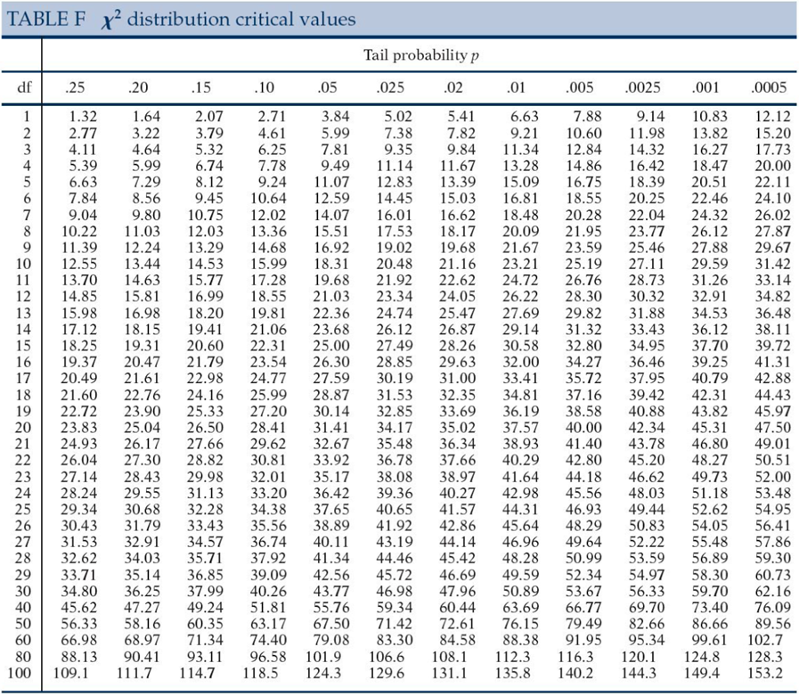
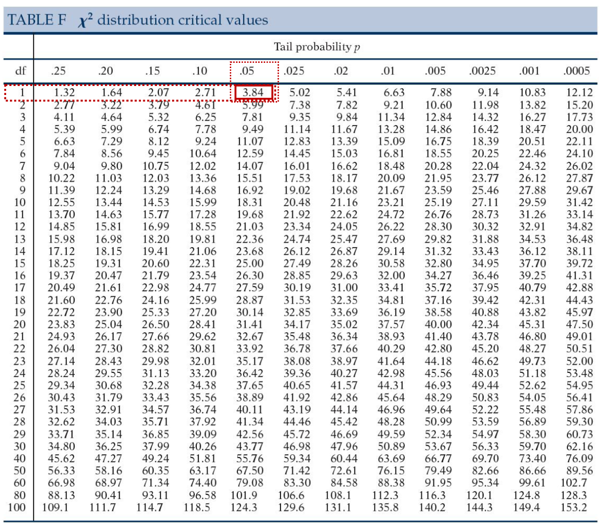
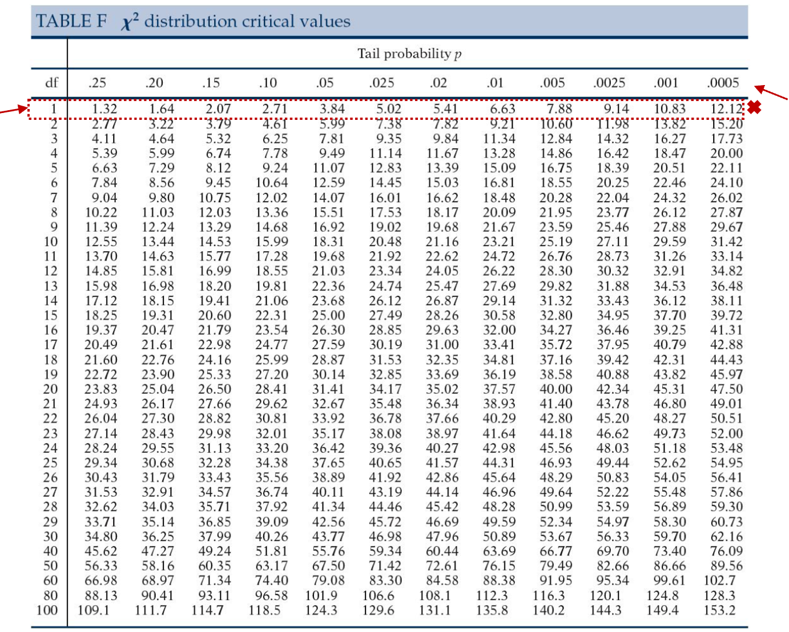

# Kí-kvaðrat æfingardæmi

Þú átt að athuga hvort það sé samband á milli þess hvort fólk um borð Titanic dóu eftir hárlit þeirra. Neðangreind útlistun gefur þér allar þær upplýsingar sem þú þarft. *Athugaðu að þessar upplýsingar eru klárlega algjört kjaftæði*

Það voru alls 433 farþegar, 210 þeirra dóu og 223 lifðu af. Af þeim sem dóu voru 80 með dökkt hár og 130 með ljóst hár, af þeim sem lifðu af voru 58 með ljóst hár og 165 með dökkt hár.

Þú ættir nú að geta sett upp töflu með rauntíðni og jaðardreifingu, fundið væntitíðni fyrir hver hólf sniðsins og greint frá skilyrtri dreifingu eftir hárlit. Næst ættir þú að geta reiknað kí-kvaðratgildið, athugað marktekt þess, reiknað áhrifastærð og líkindahlutfall. Loks ættir þú að geta sett marktektarniðurstöður fram og gefið túlkun á öllum helstu upplýsingum sem skipta máli.

## Rauntíðni og jaðardreifing.

|          | Hárlitur |      |         |
|----------|----------|------|---------|
| Dauði?   | Dökkur   | Ljós | Samtals |
| Dó       | ?        | ?    | ?       |
| Lifði af | ?        | ?    | ?       |
| Samtals  | ?        | ?    | ?       |

: Fylltu inn í þessa töflu

Ýttu hér fyrir útfyllta töflu

|          | Hárlitur |      |         |
|----------|----------|------|---------|
| Dauði?   | Dökkur   | Ljós | Samtals |
| Dó       | 80       | 130  | 210     |
| Lifði af | 165      | 58   | 233     |
| Samtals  | 245      | 188  | 433     |

## Væntitíðni

Finndu væntitíðni fyrir hvert hólf sniðsins. Miðaðu við 2 aukastafi en námundaðu þann síðari ef við á.

|          | Hárlitur |      |
|----------|----------|------|
| Dauði?   | Dökkur   | Ljós |
| Dó       | ?        | ?    |
| Lifði af | ?        | ?    |

: Fylltu inn í þessa töflu

Ýttu hér fyrir útfyllta töflu

|          | Hárlitur |       |
|----------|----------|-------|
| Dauði?   | Dökkur   | Ljós  |
| Dó       | 118,82   | 91,18 |
| Lifði af | 126,18   | 96,82 |

## Skilyrt dreifing.

Reiknaðu skilyrta dreifingu eftir hárlit. Hafðu 2 aukastafi en námundaðu þann síðari ef við á.

|          | Hárlitur |      |
|----------|----------|------|
| Dauði?   | Dökkur   | Ljós |
| Dó       | ?        | ?    |
| Lifði af | ?        | ?    |
| Samtals  | ?        | ?    |

: Fylltu inn í þessa töflu

Ýttu hér fyrir útfyllta töflu

|          | Hárlitur |        |
|----------|----------|--------|
| Dauði?   | Dökkur   | Ljós   |
| Dó       | 32,65%   | 69,15% |
| Lifði af | 67,35%   | 30,85% |
| Samtals  | 100%     | 100%   |

## Kí-kvaðratgildið

Reiknaðu kí-kvaðratgildið.

${\chi}^2=\sum\frac{(Raungildi-Væntigildi)^2}{Væntigildi}$

Ýttu hér fyrir úrlausn kí-kvaðratgildis

${\chi}^2 = \frac{(80 - 118,82)^2}{118,82} + \frac{(130 - 91,18)^2}{91,18} + \frac{(165 - 126,18)^2}{126,18} + \frac{(58 - 96,82)^2}{96,82}$

${\chi}^2 = 12,68 + 16,53 + 11,95 + 15,56$

${\chi}^2 = 56,72$

Reiknaðu einnig frígráðurnar:

$df = (r-1)(c-1)$

Ýttu hér rétta úrlausn frígráða

$df = (2-1)(2-1)$

$df = 1*1$

$df = 1$

## Athugaðu marktekt

Sýndu mér töfluna

**Hvert er vendigildið (critical value)?**

Skilgreining vendigildis:

Vendigildi gefur okkur hvað kí-kvaðratgildi þyrfti að lágmarki að vera til að niðurstaða yrði marktæk.

Vísbending 1:

Þú þarf að vera með frígráður og $\alpha$ til að finna vendigildið.

Vísbending 2:

Við miðum við ${\alpha}=0,05$ og ${df}=1$

Rétt svar í töflu:

Rétt svar í samfelldu máli:

Kí-kvaðratgildi okkar þyrfti að vera yfir 3,84 til að reynast marktækt.

**Er prófið marktækt? Hvert er *p*-gildi prófsins?**

Vísbending

þú þarft að vera með frígráður og kí-kvaðratgildi til að finna nákvæmara *p*-gildið

Rétt svar í töflu:

Rétt svar í samfelldu máli:

Já, kí-kvaðratgildið reynist marktækt. Miðað við ${df}=1$ og ${\alpha}=0,05$ þá þyrfti prófstærð okkar að vera 3,84 til að ná marktekt. Kí-kvaðratgildi reyndist hér 56,72 sem liggur utan töflunar, samsvarandi *p*-gildi yrði því undir 0,0005, eða p \<0,001.

## Reikna áhrifastærð

Við útreikning áhrifastærðar ætlum við að miða við Cramer's V:

$V= \sqrt\frac{{\chi}^2}{n * min (r-1, c-1)}$

Réttur útreikningur

$V= \sqrt\frac{56,72}{433 * 1}$

$V= \sqrt\frac{56,72}{433 * 1}$

$V= \sqrt{0,13099}$

$V= 0,36192$

## Líkindahlutfall

Reiknaðu líkindahlutfall sem lýsa því hversu mikið líklegri þeir sem eru ljóshærðir séu að deyja heldur en þeir sem eru dökkhærðir.

Til þessa þarftu að athuga:

1.  Reikna líkindi fyrir þá sem eru með ljóst hár og deyja
2.  Reikna líkindi fyrir þá sem eru með dökkt hár og deyja
3.  Reikna líkindahlutfall.

Réttur útreikningur og svar

$Odds_{ljóshærðir sem deyja} = \frac{130}{58} = 2,24$

$Odds_{dökkhærðir sem deyja} = \frac{80}{165} = 0,48$

$OddsRatio = \frac{Odds_{ljóshærðir sem deyja}}{Odds_{dökkhærðir sem deyja}} = \frac{2,24}{0,48} = 4,6$

Þeir sem eru með ljóst hár eru 4,6x líklegri til að deyja.

## Túlkun niðurstaðna.

Hvernig setjum við niðurstöður marktektarprófsins fram á formlegan hátt?

Fylltu inn í eftirfarandi framsetningu:

${\chi}^2 (?, N = ?) = ?, p = ?$

Útskýring á spurningamerkjunum

${\chi}^2 (df, N = fjöldi) = {\chi}^2, p = p-gildi$

Rétt útfyllt

${\chi}^2 (1, N = 433) = 56,72, p < 0,001$

**Greindu frá niðurstöðunum**

Byrjaðu á því að draga saman upplýsingar úr krosstöflu, taktu niðurstöður síðan saman í stuttu máli þar sem marktektarniðurstöður eru settar fram á formlegan hátt ásamt áhrifastærð og líkindahlutfalli.

Samantekt á krosstöflu

Alls 210 farþegar dóu (48,5% allra farþega) og af þessum voru 130 ljóshærð (62% af heild þeirra sem dóu) og 80 dökkhærðir (38% af heild þeirra sem dóu). Aðrir 233 farþegar dóu ekki (54% af heildinni) og af þeim voru 58 ljóshærðir (25% af heild þeirra sem dóu ekki) og 165 voru dökkhærð (71% af heild þeirra sem dóu ekki). Af þeim sem voru ljóshærðir þá voru 69% sem dóu og 31% sem dóu ekki. Af þeim sem voru dökkhærðir voru 33% sem dóu á móti 67% sem dóu ekki. Ljóshærðir dóu frekar samanborið við dökkhærða.

Samantekt á niðurstöðum

Marktækt samband var á milli hárlitar farþega um borð Titanic og hvort þau dóu, ${\chi}^2 (1, N = 433) = 56,72, p < 0,001$. Áhrif hárlitar voru miðlungssterk, Cramer\'s V = 0,36 en líkindahlutfallið var 4,6 þar sem ljóshærðir voru 4,6x líklegri til að deyja heldur en dökkhærðir.

