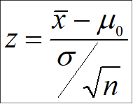

## Almennar lagfæringar 

- Breyta um lit á skilgreiningum 
- setja tilvísanir aftast í orðabok
- bæta við textbox. 
  - t.d. í index í setningu "Þessi spurning gefur til kynna að við "
- https://bookdown.org/yihui/bookdown/html-widgets.html


# Umfjöllun sem vantar 

## Hugtök - tegundir breyta 
- Frumbreyta 
- fylgibreyta 
- Bæta við samfelldu, flokka osfrv. 

## Forsendur: 
Að lokum þarf að huga að því að öll marktektarpróf byggja á forsendum sem eru ólíkar eftir því hvaða marktektarpróf um ræðir. Standist forsendur segir það okkur að útreikningur p-gilda sé að gefa okkur réttar líkur. Sé forsendubrestur til staðar er hættan sú að p-gildið sem fæst sé að of- eða vanmeta líkindin svo að við getum ekki lengur treyst því að þau alpha mörk sem við ákváðum eigi enn við.
Jú við gætum búist við hærri tekjum fyrir vikið ^[]

##Yfirlit marktektarprófa: 
- z próf: einfaldasta marktektarprófið. Notar normaldreifingu, þýðisstaðalfrávik er þekkt. 
- t próf: byggir á breyttri útgáfu normaldreifingar - t.dreifingu. 


## Útskýra normaldreifingu 


## Z próf 
- uppfletting í töflum 
- z-próf 
- Einhliða vs tvíhliða: 
Prófið getur ýmist verið einhliða eða tvíhliða eftir því hvort aðaltilgátan tilgreinir frávik upp á við, niður á við eða í hvora átt sem er. 
Þetta er sama og við fjölluðum um í tilgátum, þ.e. ef tilgátan okkar er einhliða þá notum við einhliða próf. Ef tilgátan okkar er tvíhliða þá notum við tvíhliða próf. (þ.e. hvort við séum að segja „hærra en / lægra en / ólíkt“ ) 
https://www.statisticshowto.com/probability-and-statistics/z-score/ 
```{r, include=FALSE, fig.cap="mynd 2. formula z-prófs"}

```


Ef aðaltilgátan er einhliða þá stendur p-gildið eins og það kemur úr töflunni. 
Ef aðaltilgátan er tvíhliða þá þarf sömuleiðis að tvöfalda p-gildið til að gera grein fyrir báðum endum kúrfunnar. 


## Nánar um öryggisbil 


## T próf 


# Almennt sem ég þarf að athuga
- tékka á lokaprófi 
- athuga með hjálparsíðu bókarinnar 


# Vandamál 


